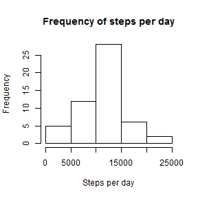
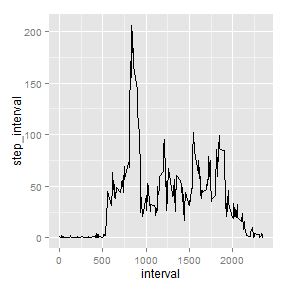
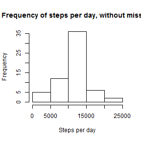
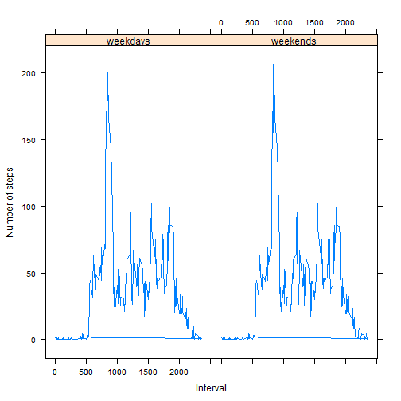

## Reproducible Research

### Peer Assessment 1
=====================

### *István Ilyés*


 *1. Loading and preprocessing the data*


```r
sourceurl <- "https://d396qusza40orc.cloudfront.net/repdata%2Fdata%2Factivity.zip"
zipDestFile <- "C:\\S\\Coursera\\Reproducable research\\PA1\\activity.zip"
download.file(sourceurl, zipDestFile)
```

```
## Error: unsupported URL scheme
```

```r
unzip(zipDestFile, overwrite = TRUE)
activity <- read.csv("activity.csv", colClasses = c("numeric", "Date", "numeric"))
str(activity)
```

```
## 'data.frame':	17568 obs. of  3 variables:
##  $ steps   : num  NA NA NA NA NA NA NA NA NA NA ...
##  $ date    : Date, format: "2012-10-01" "2012-10-01" ...
##  $ interval: num  0 5 10 15 20 25 30 35 40 45 ...
```


 *2. What is mean total number of steps taken per day?*

First Make a histogram of the total number of steps taken each day.


```r
step_day  <- tapply(activity$steps, activity$date, sum)
```


```r
hist(step_day, main ="Frequency of steps per day", xlab="Steps per day")
```

 

Then let's see the mean and the median:      
a, mean     


```r
mean_day  <-mean   (step_day, na.rm=TRUE)
mean_day
```

```
## [1] 10766
```

b, median

```r
median_day<-median (step_day, na.rm=TRUE)
median_day
```

```
## [1] 10765
```

*3. What is the average daily activity pattern?*  

Time series plot of the 5-minute interval (x-axis) and the average number of steps taken, averaged across all days (y-axis):


```r
activity$step_interval  <- tapply(activity$steps, activity$interval, mean, na.rm=TRUE)
library(ggplot2)
```

```r
qplot(interval,step_interval,data=activity, geom="line")
```

 

Which 5-minute interval, on average across all the days in the dataset, contains the maximum number of steps?


```r
activity$max_step <- max(activity$step_interval, na.rm=FALSE)
activity$interval[activity$step_interval==activity$max_step]
```

```
##  [1] 835 835 835 835 835 835 835 835 835 835 835 835 835 835 835 835 835
## [18] 835 835 835 835 835 835 835 835 835 835 835 835 835 835 835 835 835
## [35] 835 835 835 835 835 835 835 835 835 835 835 835 835 835 835 835 835
## [52] 835 835 835 835 835 835 835 835 835 835
```

*4. Imputing missing values*

Calculating and reporting the total number of missing values in the dataset: 

```r
colSums(is.na(activity))
```

```
##         steps          date      interval step_interval      max_step 
##          2304             0             0             0             0
```


Filling in all of the missing values in a new dataset. Strategy for imputing: using the mean per intervals


```r
activity2 <- activity
activity2$steps[is.na(activity2$steps)] <- tapply(activity2$steps, 
                                                  activity2$interval, mean, na.rm=TRUE)
```

   
Making a histogram of the total number of steps taken each day and calculating and report the mean and median total number of steps taken per day.


```r
step_day2  <- tapply(activity2$steps, activity2$date, sum)
hist(step_day2, main ="Frequency of steps per day, without missing", xlab="Steps per day")
```

 

```r
mean_day2  <-mean   (step_day2)
median_day2<-median (step_day2)
mean_day2
```

```
## [1] 10766
```

```r
median_day2
```

```
## [1] 10766
```

The median is higher with 1 compared to the dataset where there were missing values.The histogram shows that the middle bracket of total daily steps has increased in the new dataset (between 10000-15000 steps)


*5. Are there differences in activity patterns between weekdays and weekends?*


New factor variable with two levels - "weekday" and "weekend" indicating whether a given date is a weekday or weekend day:


```r
Sys.setlocale("LC_TIME","English")
```

```
## [1] "English_United States.1252"
```

```r
activity2$day <- weekdays(as.Date(activity2$date))
day <- activity2$day
activity2$week_stat = ifelse(day=="Monday"| day=="Tuesday"| 
                   day=="Wednesday"|day=="Thursday"|day=="Friday",
                   "weekday", "weekend")
activity2$week = factor(activity2$week_stat,
                        labels = c("weekdays", "weekends"))
```

Panel plot containing a time series plot (i.e. type = "l") of the 5-minute interval (x-axis) and the average number of steps taken, averaged across all weekday days or weekend days (y-axis):


```r
library(lattice)
xyplot(activity2$step_interval ~ activity2$interval | activity2$week,
       type="l", xlab="Interval", ylab="Number of steps")
```

 


